  

<table>
  <tr>
    <td valign="centre"></td>
    <td valign="top"></td>
  </tr>
</table>

<!-- HERO SECTION -->

  
  <h3><strong>Cloud Engineer | AWS & DevOps Enthusiast</strong></h3>
  
<i>Building cloud-native systems, CI/CD pipelines, and secure serverless architecture on AWS.</i>

  

    
    
    
    
    
    
    
  

  
  

 

<!-- ABOUT & MEDIA SECTION -->
<!-- ================= ABOUT ME ================= -->
<h2 align="center">🚀 About Me</h2>

<table width="100%" border="0">
<tr>
<td width="40%" valign="top" style="border: none; background: none;">

### 👨‍💻 Who am I?

* ☁️ **Cloud Engineer** passionate about building scalable, secure infrastructure on AWS.
* 📦 Hands-on with **ECS, Lambda, CodeDeploy, Glue, DMS**, and event-driven architecture.
* 🚀 Currently building production-grade AWS portfolio projects — blue-green deployments, data migrations, and serverless data lakes.
* 🌱 Currently learning **Kubernetes, Terraform, AWS CDK, and advanced DevOps automation.**
* 🛡️ Cybersecurity background powering a **secure-by-design** approach to every environment I build.

<blockquote>
  

    <i>"I don't just provision infrastructure. I build resilient cloud systems that solve real-world problems."</i>
  

</blockquote>

</td>

<td width="60%" align="center" valign="middle" style="border: none; background: none;">

</td>
</tr>
</table>

---

<!-- ================= CLOUD & DEVOPS ================= -->
<!-- Section Header with subtle typing or glow effect layout -->
<!-- Section Header with a matching Dark/Glow theme -->

<!-- Animated Footer Divider -->

  

---

### 🏅 Highlights

- ☁️ **4 AWS portfolio projects** built end-to-end from scratch
- 🔄 **Blue-green deployments** — CodeDeploy with ECS, Lambda, and automated rollbacks
- 🗄️ **Oracle → Aurora PostgreSQL migration** — DMS + Schema Conversion Tool
- 🏗️ **Serverless data lake** — Lambda layers, Glue ETL, and EventBridge orchestration
- 🛡️ **Security incident-response automation** — Security Hub, EventBridge, and Lambda
- 🔐 Cybersecurity background applying **secure-by-design** principles everywhere
<!-- SKILLS SHOWCASE -->
<h2>⚡ Tech Stack & Engineering Arsenal</h2>

<table width="100%" align="center">
  <tr>
    <td width="50%" valign="top">
      <h3>💻 Languages</h3>
      
        
      <h3>⚙️ Backend & Scripting</h3>
      
        
      <h3>🗄️ Databases & Caching</h3>
      
        
      <h3>☁️ Cloud & DevOps</h3>
      
    </td>
    <td width="50%" valign="top">
      <h3>🛠️ AWS Services</h3>
      

        
        
         
        
        
        
        
         S3 • RDS / Aurora • DynamoDB • ALB • ECR • CloudWatch • SNS • Security Hub • IAM
      

       
      <h3>📊 Data Engineering</h3>
      
AWS Glue • AWS DMS • ETL • CDC Pipelines • Data Lakes • Athena • Schema Conversion • Partitioning

       
      <h3>🔐 Security & Access Control</h3>
      
IAM Least Privilege • Security Hub • GuardDuty • CloudWatch Alarms • Incident Response • Automation

    </td>
  </tr>
</table>

<!-- PROJECTS -->
<h2>💼 Featured Projects</h2>

<table width="100%">
  <tr>
    <td width="50%" valign="top">
      <h3>🔄 <a href="https://github.com/ArenRedd/advanced-blue-green-deployments">Advanced Blue-Green Deployments</a></h3>
      
Zero-downtime blue-green deployments for ECS and Lambda with AWS CodeDeploy, automated health checks, traffic shifting, and rollback triggers.

      

        <code>CodeDeploy</code> <code>ECS</code> <code>Lambda</code> <code>ALB</code> <code>CloudWatch</code> <code>SNS</code>
      

      <ul>
        <li>✔ Dual target groups with automatic traffic shifting</li>
        <li>✔ Alarm-driven automated rollbacks & lifecycle hooks</li>
      </ul>
    </td>
    <td width="50%" valign="top">
      <h3>🗄️ <a href="https://github.com/ArenRedd/oracle-to-postgresql-migration-dms">Oracle to PostgreSQL Migration</a></h3>
      
Heterogeneous database migration from Oracle to Aurora PostgreSQL using AWS DMS and Schema Conversion Tool with minimal downtime.

      

        <code>DMS</code> <code>Aurora PostgreSQL</code> <code>SCT</code> <code>RDS</code> <code>CDC</code>
      

      <ul>
        <li>✔ Full-load + continuous change data capture</li>
        <li>✔ Schema conversion assessment & post-migration validation</li>
      </ul>
    </td>
  </tr>
  <tr>
    <td width="50%" valign="top">
      <h3>🏗️ <a href="https://github.com/ArenRedd/serverless-data-lake-architecture">Serverless Data Lake Architecture</a></h3>
      
Event-driven serverless data lake with Lambda layers, Glue ETL, EventBridge orchestration, and automated data quality validation.

      

        <code>Lambda</code> <code>Glue</code> <code>EventBridge</code> <code>S3</code> <code>DynamoDB</code> <code>Athena</code>
      

      <ul>
        <li>✔ Shared Lambda layers & quality scoring with quarantine</li>
        <li>✔ Crawler-driven schema discovery & custom CloudWatch metrics</li>
      </ul>
    </td>
    <td width="50%" valign="top">
      <h3>🛡️ <a href="https://github.com/ArenRedd/security-incident-response-automation">Security Incident Response Automation</a></h3>
      
Automated incident response with Security Hub, EventBridge, and Lambda — classification, remediation workflows, and SNS notifications.

      

        <code>Security Hub</code> <code>EventBridge</code> <code>Lambda</code> <code>SNS</code> <code>IAM</code>
      

      <ul>
        <li>✔ Severity-based classification & automated remediation</li>
        <li>✔ Manual escalation & Security Hub insights for tracking</li>
      </ul>
    </td>
  </tr>
</table>

<!-- ENGINEERING EXPERIENCE -->
<h2>🚀 Cloud Engineering Experience</h2>

Throughout my cloud journey, I have designed and implemented production-grade AWS systems across multiple domains.

<table width="100%">
  <tr>
    <td width="33%" valign="top">
      <h3>🌐 Compute & Containers</h3>
      <ul>
        <li>AWS ECS with Fargate</li>
        <li>Lambda serverless functions</li>
        <li>Docker containerization</li>
        <li>Application Load Balancers</li>
        <li>ECR image registry</li>
      </ul>
    </td>
    <td width="33%" valign="top">
      <h3>⚡ CI/CD & Deployments</h3>
      <ul>
        <li>CodeDeploy blue-green</li>
        <li>Traffic shifting & canary</li>
        <li>Automated rollbacks</li>
        <li>Deployment lifecycle hooks</li>
        <li>GitHub Actions</li>
      </ul>
    </td>
    <td width="34%" valign="top">
      <h3>🗄️ Data & Migration</h3>
      <ul>
        <li>AWS DMS replication</li>
        <li>Schema Conversion Tool</li>
        <li>Aurora PostgreSQL & RDS</li>
        <li>Glue ETL & data lakes</li>
        <li>Change Data Capture (CDC)</li>
      </ul>
    </td>
  </tr>
  <tr>
    <td width="33%" valign="top">
      <h3>🛡️ Security & Monitoring</h3>
      <ul>
        <li>Security Hub aggregation</li>
        <li>Incident-response automation</li>
        <li>IAM least privilege</li>
        <li>CloudWatch metrics & alarms</li>
        <li>SNS notifications</li>
      </ul>
    </td>
    <td width="33%" valign="top">
      <h3>🏗️ Event-Driven Architecture</h3>
      <ul>
        <li>EventBridge custom buses</li>
        <li>Content-based routing rules</li>
        <li>S3 event notifications</li>
        <li>Decoupled pipelines</li>
        <li>Intelligent data routing</li>
      </ul>
    </td>
    <td width="34%" valign="top">
      <h3>🔧 Infrastructure as Code</h3>
      <ul>
        <li>Terraform</li>
        <li>AWS CDK</li>
        <li>CloudFormation</li>
        <li>Bash automation scripts</li>
        <li>Reproducible environments</li>
      </ul>
    </td>
  </tr>
</table>

<!-- HIGHLIGHTS -->
<h2>🏆 Cloud Portfolio Highlights</h2>

I have designed and built <strong>4 production-grade AWS portfolio projects</strong> covering deployment automation, data migration, analytics, and security.

  <strong>🚀 Technologies & Architectures Worked On:</strong> 
  Blue-Green Deployments (ECS & Lambda) • CodeDeploy Traffic Shifting • CloudWatch Alarm-Driven Rollbacks • Oracle → Aurora PostgreSQL Migration • AWS DMS Full-Load + CDC • Schema Conversion (SCT) • Serverless Data Lakes • Lambda Layers • Glue ETL Pipelines • EventBridge Custom Buses • Data Quality Validation • Security Incident Response Automation • Security Hub Findings • Automated Remediation • IAM Least Privilege • SNS Notifications • S3 Storage Architecture • DynamoDB Metadata Stores

<!-- GITHUB STATS -->
<h2>📈 GitHub Analytics & Open Source Activity</h2>

  
  

  

    
  

  

    
  

  

    
  

